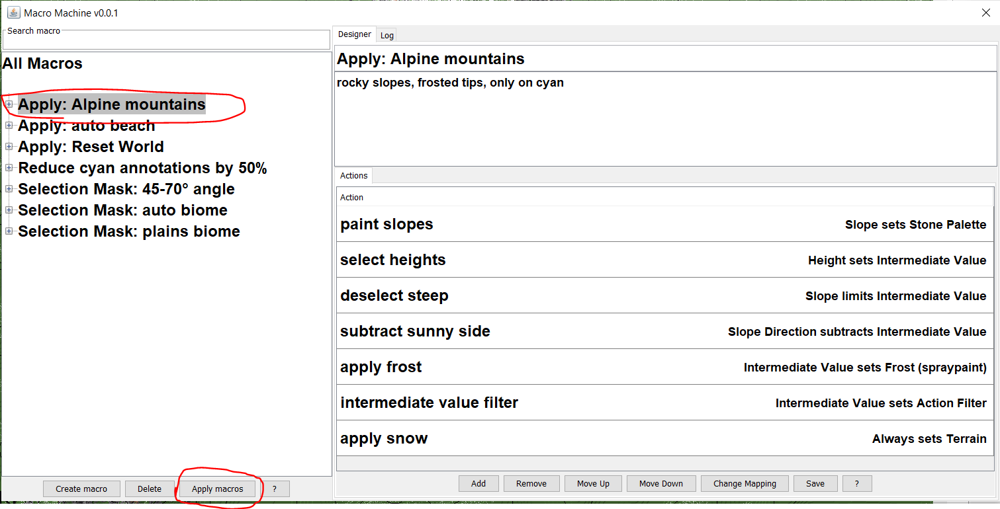
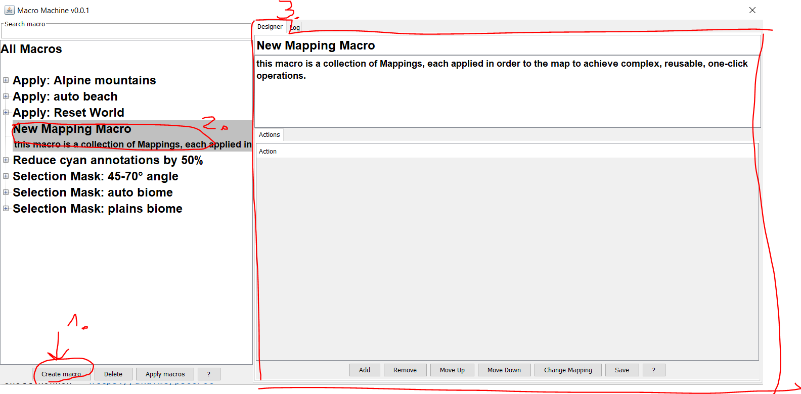
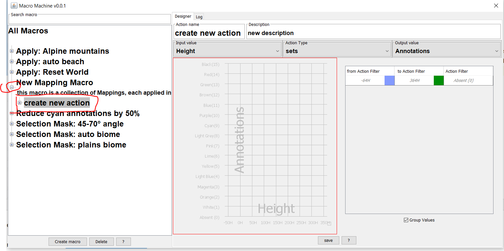
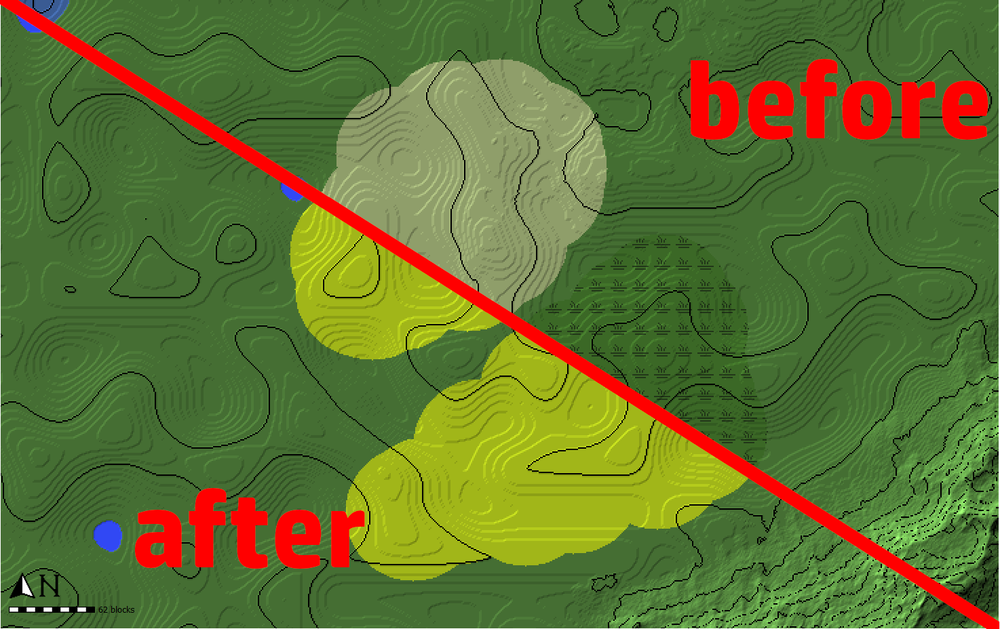
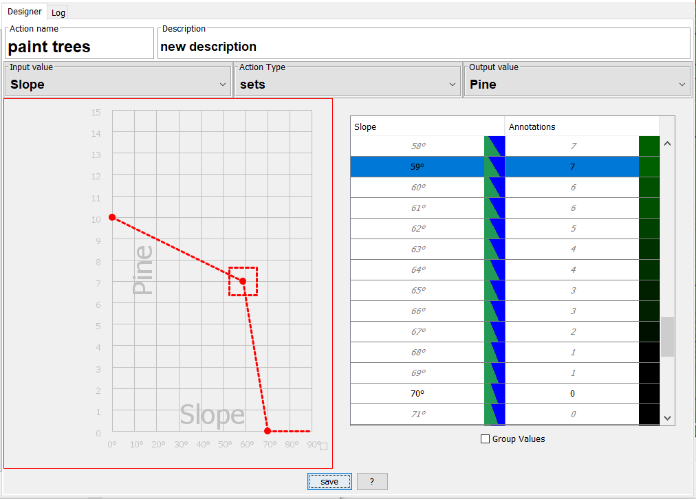
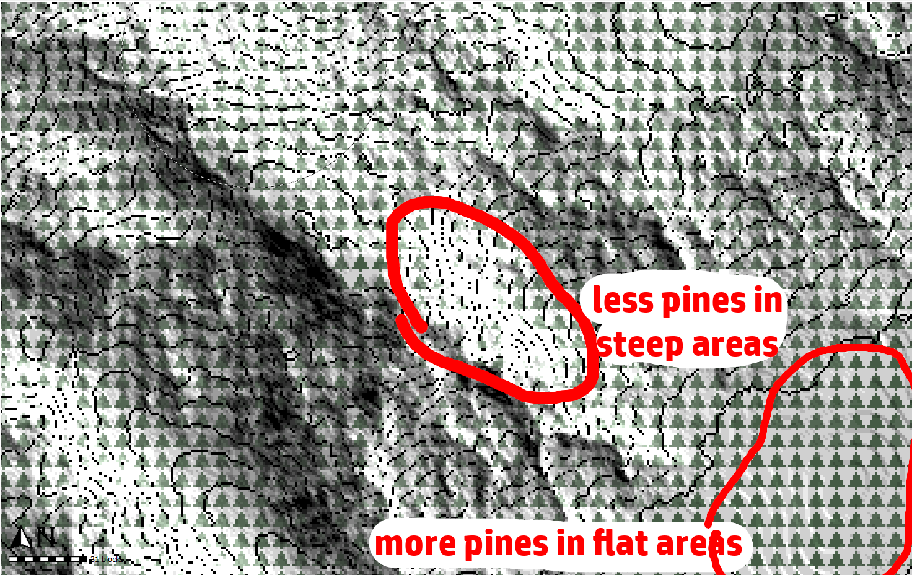
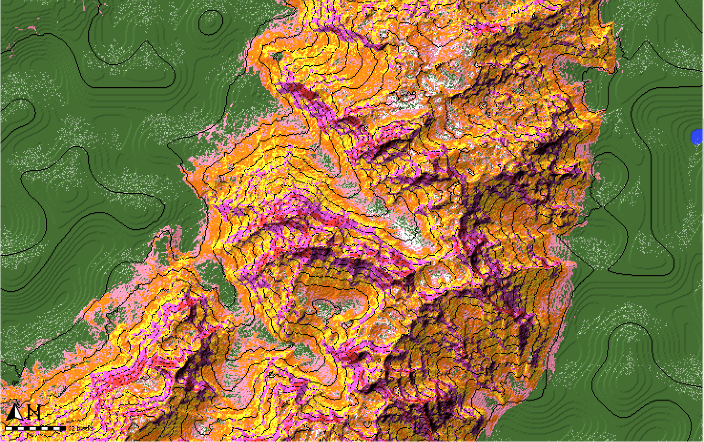

# WorldPainter MacroMachine Plugin
[plugin github page](https://github.com/IR0NSIGHT/MacroMachine-WpPlugin)   
The _MacroMachine_ Plugin automates global operation workflows.
Define simple actions, like applying terrain to certain slopes, and combine many actions into a Macro, that is executed with a single click across the whole map.
Actions and Macros are saved into the plugins folder and available in all worldpainter projects.

Its comparable to chaining many global operations, and be able to save that workflow so it can be reused.

## Tutorials
This youtube [playlist](https://youtube.com/playlist?list=PLyNqTiCLQP-gTNoBJlvTK3xeIs6RQjUkl&si=5lPTMk5lmbzcvMZM) contains tutorial videos that cover the most important steps.

## Download
[Youtube Tutorial](https://youtu.be/FtfwxDTzWgk?si=2JaUsOgvU1c2SFsF)  
1. go to the [release page](https://github.com/IR0NSIGHT/MacroMachine-WpPlugin/releases/latest)
2. select the top most Macro-Machine release
3. download the Macro-Machine-Plugin-x.x.x.jar file
4. open worldpainter
5. go to top bar -> tools -> open plugins folder
6. place the downloaded jar file in the folder
7. restart worldpainter

## Use Macros
[Youtube Tutorial](https://youtu.be/to27vExZfoM?si=CPMGnqGgRdljYbB3)  
1. Find the Macro tool and left click it. The macro panel will open.  

2. Select the macro you want to execute by left clicking it in the tree view.  

3. Press "Apply Macros" on the bottom, the macro will execute globally on the whole map.

4. Click into worldpainter or close the Macro Panel. 
5. Deselect macro tool, reselect macro tool to open the panel again.

## Edit Macros
[Youtube Tutorial](https://youtu.be/jog4qHFP4WI?si=gqlX9unvOYhtRQ4x)  
Let's create a simple macro that creates a mask for us:  add all Swamp and Desert biome to selection. 
1. Create a new macro by clicking "Create Macro". A new macro with the name "New mapping macro" appears in the tree panel.
2. Left click "New Mapping Macro". It is now shown in the macro designer on the right.  

3. The macro is a list of actions that are run in fixed order. Topmost action goes first, bottom most action goes last. Right now the list is still empty.
4. Click "Add", then select "create new action" in the dialog. A new action is created and added to the list. Press "save" to save the changes we made to this macro.
5. In the tree view (left), expand the Macro. You can see that is now has an action listed. Select the action  

6. The Action Designer now opens on the right. Select "biome" as input, "set" as type, "selection block" as output.
7. In the table on the right, set "swamp" and "desert" to "Selection Block: ON". This means when the action is executed, all blocks that are "swamp" or "desert" biome are set to be selected. All blocks that are a different biome are deselected.  

8. Save your progressof this action with the "save" key
9. Select the macro where the action lives in.
10. Press "execute macro"
11. All swamp and desert biome blocks are now selected, everything else is deselected  

12. check the "log" tab, to see some statistics about your action.  

## Gradient Editor
Not all actions are simple "if this, then this", like our desert-and-swamp-to-selection example.
If you want to paint pine trees in flat slopes and reduce the amount the steeper it gets, a 1:1 mapping for each angle is very tedious.
For this, the gradient editor exists.
1. Create an action with input: slope, type: set, output: pines

2. The x axis (bottom) is the input values
3. The y axis (left) is the output value
4. The curve shows you which input is mapped to which output value
5. Left click into the curve to add a new point
6. Drag points to change where you want them
7. Right click to delete a point
8. Values between points are automatically interpolated
9. the curve below means that pines are set with strength=10 when the slope is 0°. the steeper the area, the lower pine strength gets, up until 60° slope with strength=7. Then it falls to strength=0 at slope=70°.

10. You can edit values in the table, but only where points are set. Editable values are black, Interpolated values are grey.
11. Run the action on a world with a mountain

12. Sometimes the input can be interpolated, but the output is fixed values, like mapping slope to annotation colors. If that happens, the gradient editor is available and you can define input ranges to map to specific values:

### Filter
If you only want to operate on some parts of the map, you should use the action filter. Create an action that uses an input to set the action filter.
Any actions in the macro after the filter action will ignore blocks that were previously filtered out.
Use Always-set-ActionFilter to reset the filter and allow all blocks.
Each filter is limited to its macro and does not influence other macros.
More restrictive filters usually also mean better performance, because less tiles have to be touched by the macro.

### Always input
Use the "Always" input to apply an output everywhere. Always still respects previous Action-Filters and will ignore filtered out blocks.

### Spraypaint
Spraypaint output will spraypaint a layer onto blocks with certain chance for each block.

### Intermediate value
This input/output only exists during the execution of the macro. it allows you to save values for the duration fo the execution.
The alpine macro uses it to store the chance for snow in each block over multple actions, before finally applying it to snow.
Its also more performance-friendly than saving the value into a layer in the world.

### Nesting macros
You can call a macro inside of another macro. But beware: if macro A calls Macro B and macro B calls Macro A, you get an infinite loop. The system will detect it and now allow you to save such a state.

### Custom layers
It's not yet possible to use custom layers as inputs or outputs. We are working on it.

## troubleshooting
Q: What does this panel do
A: Look for the "?" button and hover over buttons to see tooltips.

Q: If i click "Apply macros", nothing on my map happens
A: check the log. usually, the macro does something under special circumstances that dont exist on your map, f.e. because the map is flat and the macro tries to paint mountains in steep areas.

Q: Something broke, what now?
A: Send a bug report to @IR0NSIGHT in the discord https://discord.gg/9kRJEMfGeE or on github here. You can find your log files in the parent folder of top bar -> tools -> open plugins folder. The logs are calles logfile0.txt usually, please include the latest log file.
