# WorldPainter MacroMachine Plugin
[plugin github page](https://github.com/IR0NSIGHT/MacroMachine-WpPlugin) <br><br>
The _MacroMachine_ Plugin automates global operation workflows.
Define simple actions, like applying terrain to certain slopes, and combine many actions into a Macro, that is executed with a single click across the whole map.
Actions and Macros are saved into the plugins folder and available in all worldpainter projects.

### 100 seconds overview on Youtube
[](https://youtu.be/Q5R2G-uRatc?si=GLZmCLouRVHKsX-7)

## Tutorials
This youtube [playlist](https://youtube.com/playlist?list=PLyNqTiCLQP-gTNoBJlvTK3xeIs6RQjUkl&si=5lPTMk5lmbzcvMZM) contains tutorial videos that cover the most important steps.

### Download
[Youtube Tutorial](https://youtu.be/FtfwxDTzWgk?si=2JaUsOgvU1c2SFsF)  
1. go to the [release page](https://github.com/IR0NSIGHT/MacroMachine-WpPlugin/releases/latest)
2. select the top most Macro-Machine release
3. download the Macro-Machine-Plugin-x.x.x.jar file
4. open worldpainter
5. go to top bar -> tools -> open plugins folder
6. place the downloaded jar file in the folder
7. restart worldpainter

### Use Macros
[Youtube Tutorial](https://youtu.be/to27vExZfoM?si=CPMGnqGgRdljYbB3)  
1. Find the Macro tool and left click it. The macro panel will open.  
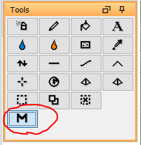
2. Select the macro you want to execute by left clicking it in the tree view.  
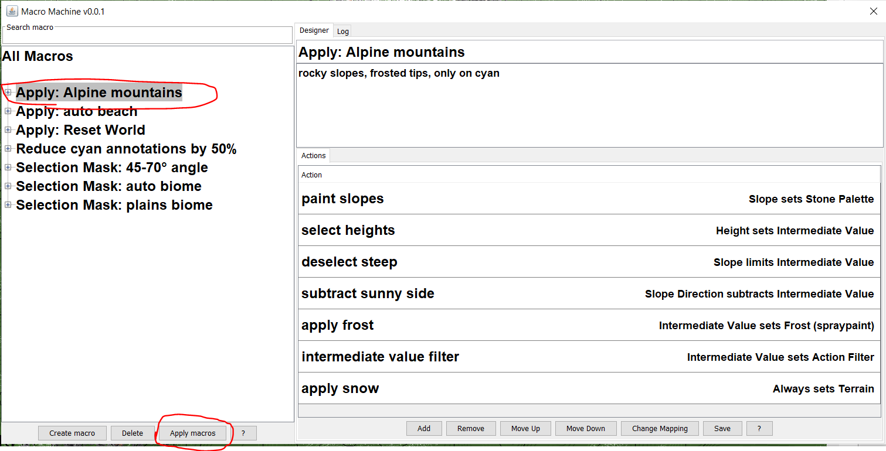
3. Press "Apply Macros" on the bottom, the macro will execute globally on the whole map.

4. Click into worldpainter or close the Macro Panel. 
5. Deselect macro tool, reselect macro tool to open the panel again.

### CityLayer
CityLayer works like a Custom Object Layer, but places individual schematics at precise positions instead of painting random placements.

1. Create a new custom layer named `CityLayer`.
2. Add schematics to the layer.
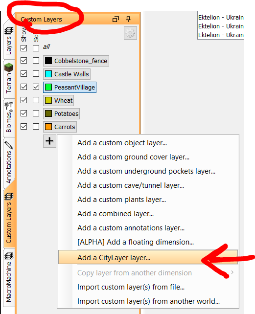
3. Select the `CityLayer`.
4. Select the CityLayer tool with the House icon.
5. Select a schematic in the tool options.
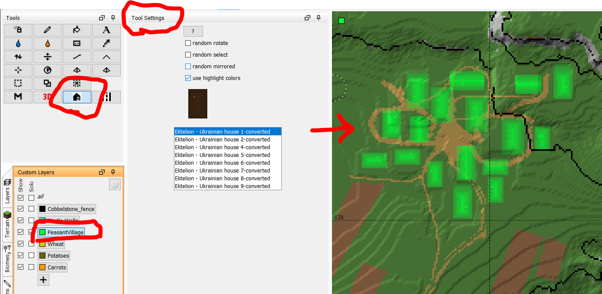
6. Place schematics on the map. Using the 3D Preview with Auto Update is recommended.

CityLayer uses each schematic's offset. Center the offset in the options for each schematic for predictable placement.

Controls:
- Left click: place the selected schematic.
- Right click: remove buildings within the brush area.
- `Ctrl` + left click: select a building on the map.
- `Ctrl` + right click: move the last placed building.
- `Shift` + mouse wheel: select a different schematic.
- `Alt` + mouse wheel: rotate the brush.
- `W`/`A`/`S`/`D`: move the selected building.
- `C`: rotate the selected building.
- `X`: mirror the selected building.

Options:
- `random rotate`: randomly rotate after each placement.
- `random select`: select another schematic after each placement.
- `random mirrored`: randomly mirror after each placement.
- `use highlight colors`: show the layer color instead of the schematic.

CityLayer is not compatible with WorldPainter undo/redo. Do not use undo/redo while editing it.

### 3D Preview
1. Open MacroMachine with the `M` tool.
2. Select the `3D Preview` tool.
3. Select an area on the map.
4. View the result in the 3D renderer.
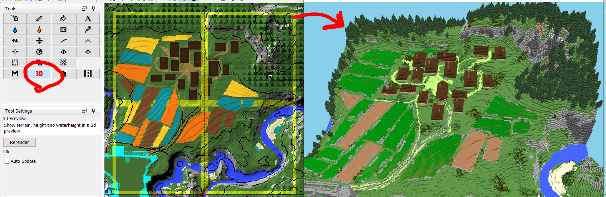

Enable `Auto Update` to refresh the preview after map edits. Large areas can cause lag with Auto Update enabled. The preview performs a background test export and uses a workaround to remove the underground from the rendered result.

### Path Tool
Place roads or rivers with the path tool, or create slopes with full control over maximum degrees. The path is automatically merged into existing terrain with a smooth transition between terrain and path.

1. Select the Path Tool (Road Icon)
2. Left Click in the map to place a node. Brush radius decides the size of the node.
3. Left Click again to place the next node and connect to the previous node
4. Use undo to delete the last node
5. Right click to reset and start a new path


Options:
- "only downhill": the path is guarenteed to only go down in height, but never upwards. Use this for rivers.
- "snap to terrain": the path will try to follow the terrain height as close as possible without creating tall walls to bridge depressions. Use this for roads
- "Use paint": the path will apply
the selected paint to the map (f.e. terrain cobblestone)
- "Curve Strength": how curved the path is. 0 = straight lines, hard edges. 1 = smooth bezier curve. I use 0.4 for roads, 1 for rivers.
- "Limit slope": the path is guaranteed to never have a steeper slope than this value. Limit to 4 blocks per 16: for 16 blocks walking along the path, the path can only rise/go down by 4 blocks. 16/16 compares to stairs. 8/16 compares to slabs. I use 4/16 for roads.  
- "Transition multiplier"


### Edit Macros
[Youtube Tutorial](https://youtu.be/jog4qHFP4WI?si=gqlX9unvOYhtRQ4x)  
Let's create a simple macro that creates a mask for us:  add all Swamp and Desert biome to selection. 
1. Create a new macro by clicking "Create Macro". A new macro with the name "New mapping macro" appears in the tree panel.
2. Left click "New Mapping Macro". It is now shown in the macro designer on the right.  
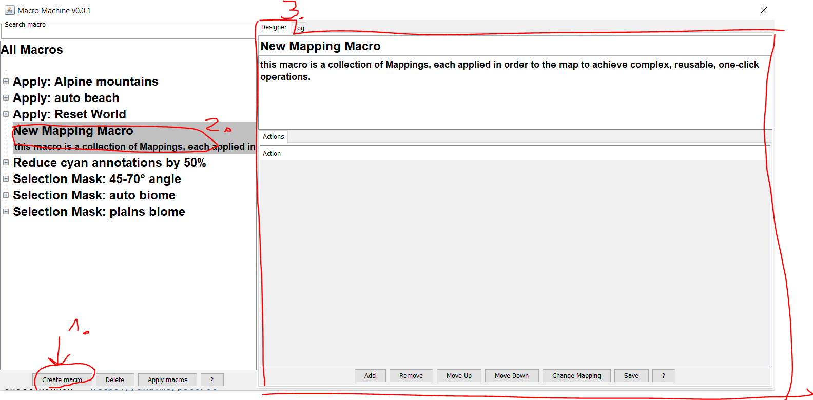
3. The macro is a list of actions that are run in fixed order. Topmost action goes first, bottom most action goes last. Right now the list is still empty.
4. Click "Add", then select "create new action" in the dialog. A new action is created and added to the list. Press "save" to save the changes we made to this macro.
5. In the tree view (left), expand the Macro. You can see that is now has an action listed. Select the action  
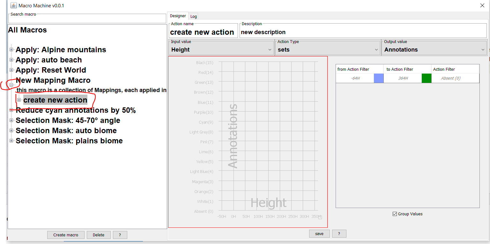
6. The Action Designer now opens on the right. Select "biome" as input, "set" as type, "selection block" as output.
7. In the table on the right, set "swamp" and "desert" to "Selection Block: ON". This means when the action is executed, all blocks that are "swamp" or "desert" biome are set to be selected. All blocks that are a different biome are deselected.  
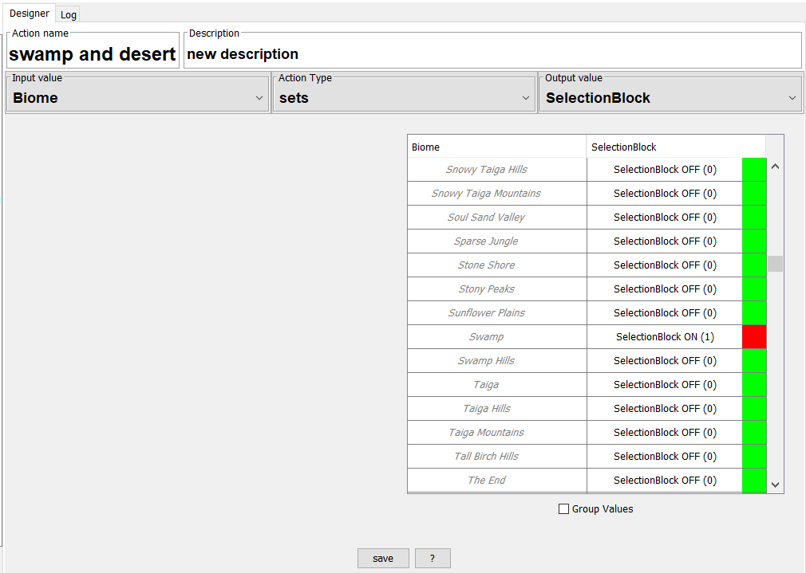
8. Save your progressof this action with the "save" key
9. Select the macro where the action lives in.
10. Press "execute macro"
11. All swamp and desert biome blocks are now selected, everything else is deselected  
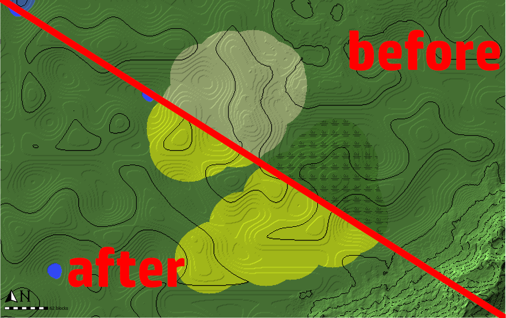
12. check the "log" tab, to see some statistics about your action.  
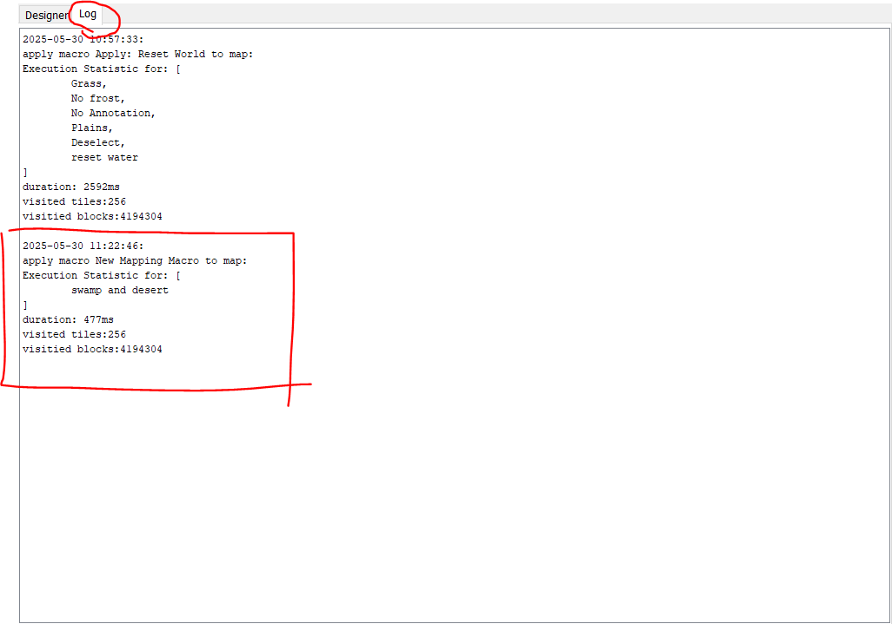

### Gradient Editor
Not all actions are simple "if this, then this", like our desert-and-swamp-to-selection example.
If you want to paint pine trees in flat slopes and reduce the amount the steeper it gets, a 1:1 mapping for each angle is very tedious.
For this, the gradient editor exists.
1. Create an action with input: slope, type: set, output: pines
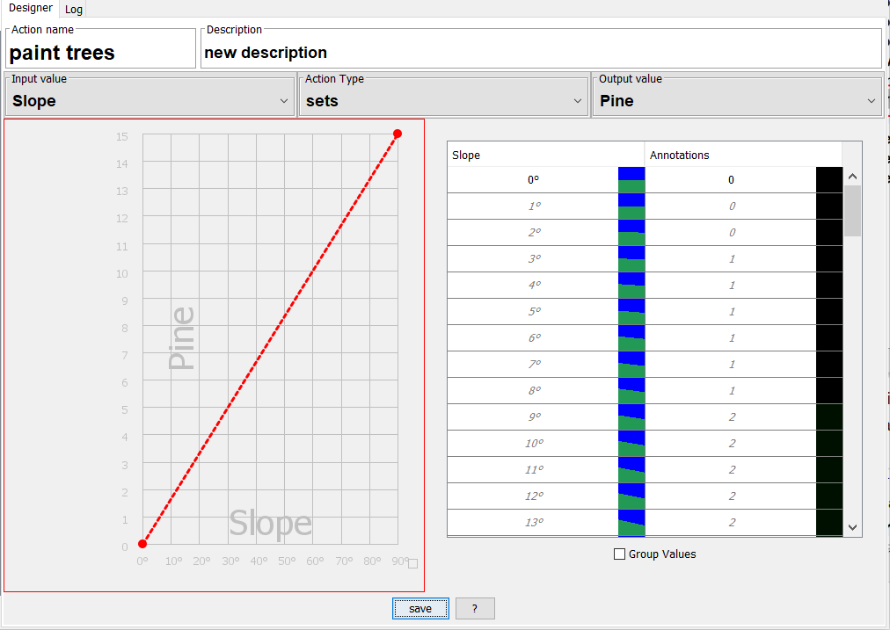
2. The x axis (bottom) is the input values
3. The y axis (left) is the output value
4. The curve shows you which input is mapped to which output value
5. Left click into the curve to add a new point
6. Drag points to change where you want them
7. Right click to delete a point
8. Values between points are automatically interpolated
9. the curve below means that pines are set with strength=10 when the slope is 0°. the steeper the area, the lower pine strength gets, up until 60° slope with strength=7. Then it falls to strength=0 at slope=70°.
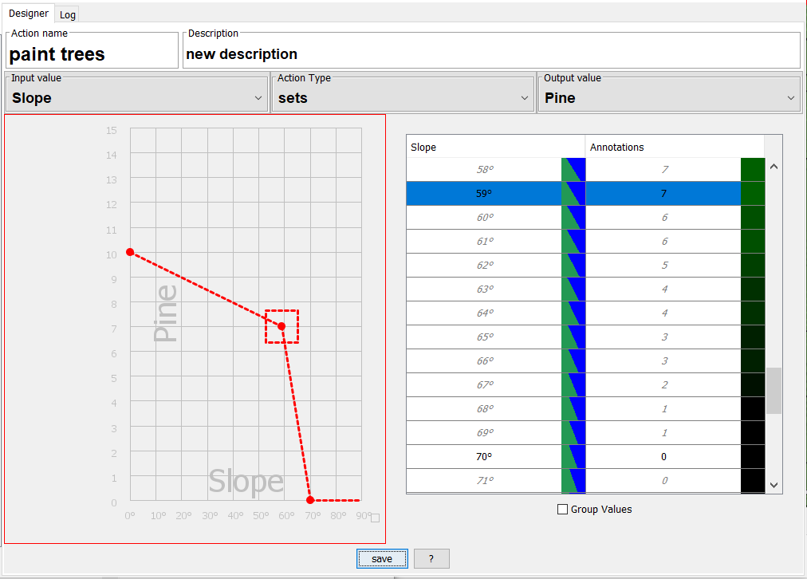
10. You can edit values in the table, but only where points are set. Editable values are black, Interpolated values are grey.
11. Run the action on a world with a mountain
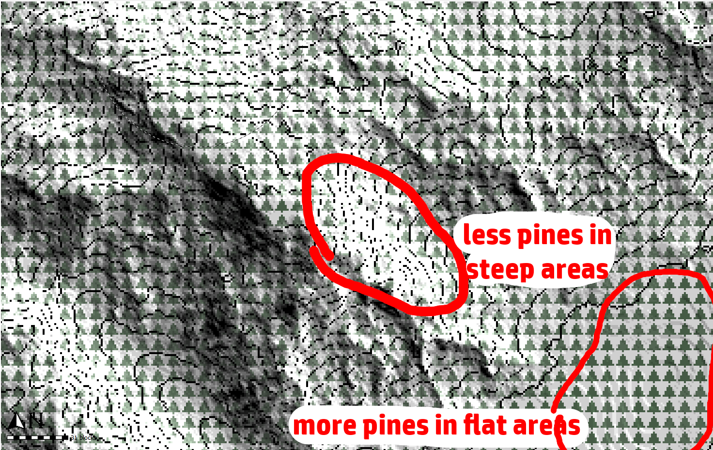
12. Sometimes the input can be interpolated, but the output is fixed values, like mapping slope to annotation colors. If that happens, the gradient editor is available and you can define input ranges to map to specific values:
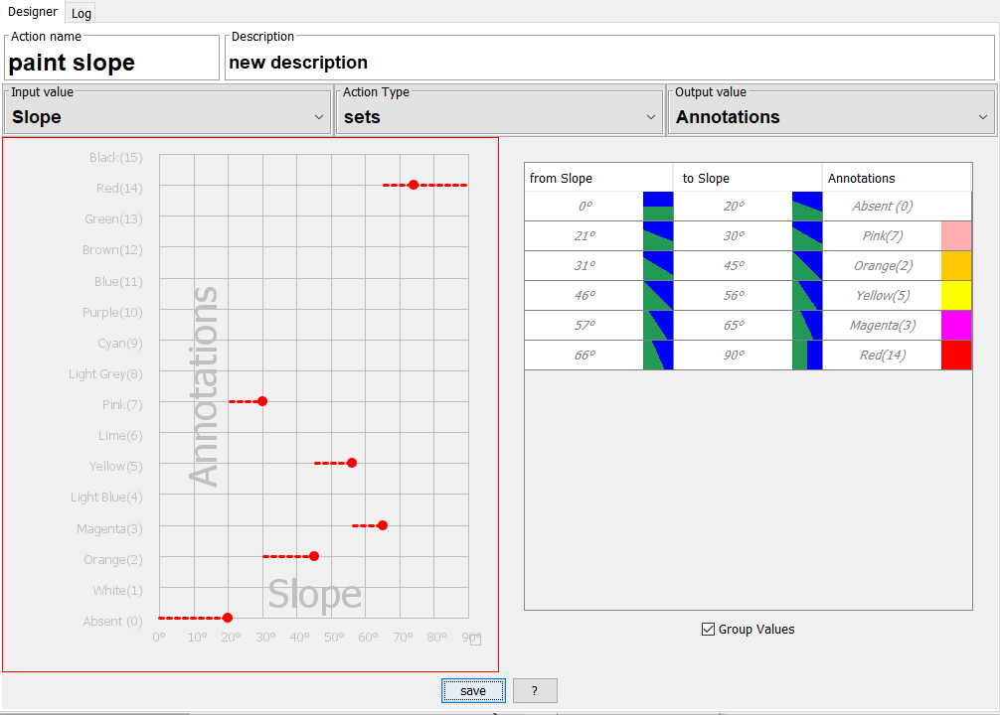
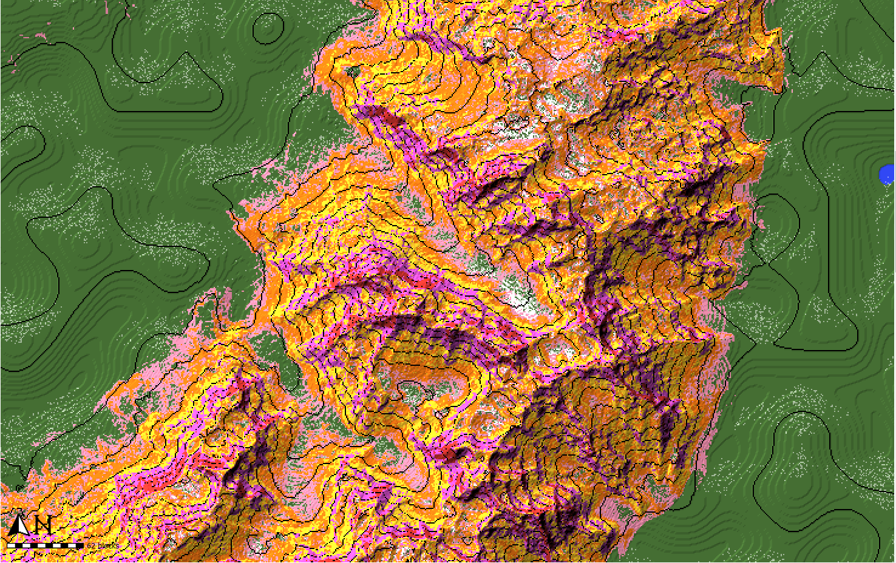

### Filter
If you only want to operate on some parts of the map, you should use the action filter. Create an action that uses an input to set the action filter.
Any actions in the macro after the filter action will ignore blocks that were previously filtered out.

Use this pattern for filters:
```
    Input: what you want to filter (f.e. Annotations)
    Type: set
    Output: Action Filter
```
then set all values you DONT want to "block" and everything else to "ignore". This will filter out all these values for any subsequent actions.

More restrictive filters usually also mean better performance, because less tiles have to be touched by the macro.

### Always input
Use the "Always" input to apply an output everywhere. Always still respects previous Action-Filters and will ignore filtered out blocks.

### Spraypaint
Spraypaint output will spraypaint a layer onto blocks with certain chance for each block.

### Intermediate value
obsolete and discontinued. please dont use it anymore.

### Nesting macros
You can call a macro inside of another macro. It will inherit the filter state and can edit it.

### Custom layers
MacroMachine offers you all customer layers in your current .world project AND all custom layers that are already used in Macros as inputs or outputs. If your custom layer is not shown, close the MacroMachine window, save your world and open the MacroMachine window again.

## troubleshooting
Q: What does this panel do
A: Look for the "?" button and hover over buttons to see tooltips.

Q: If i click "Apply macros", nothing on my map happens
A: check the log. usually, the macro does something under special circumstances that dont exist on your map, f.e. because the map is flat and the macro tries to paint mountains in steep areas.

Q: Something broke, what now?
A: Send a bug report to @IR0NSIGHT in the discord https://discord.gg/9kRJEMfGeE or on github here. You can find your log files in the parent folder of top bar -> tools -> open plugins folder. The logs are calles logfile0.txt usually, please include the latest log file.
